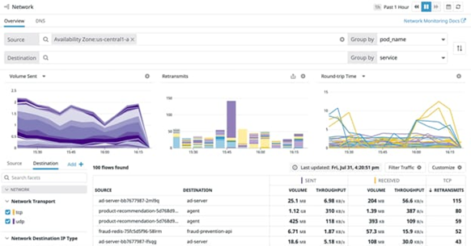
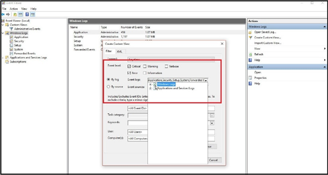
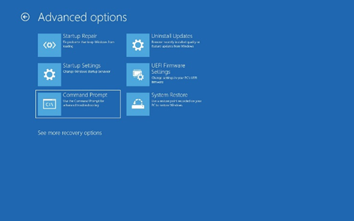
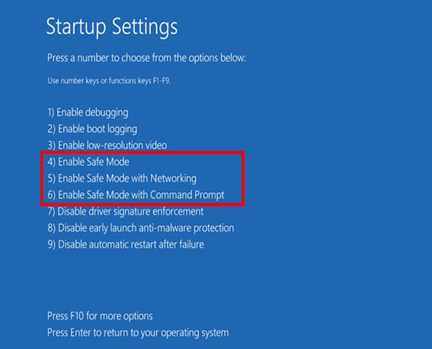
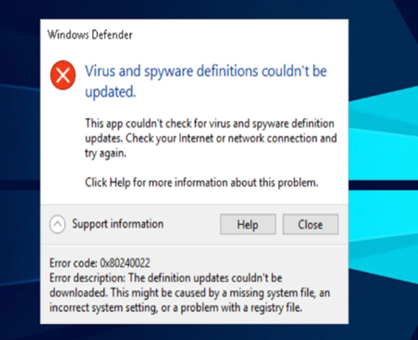
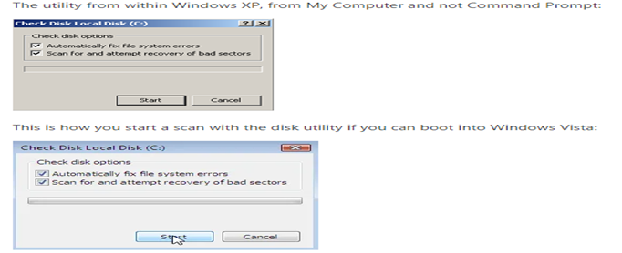
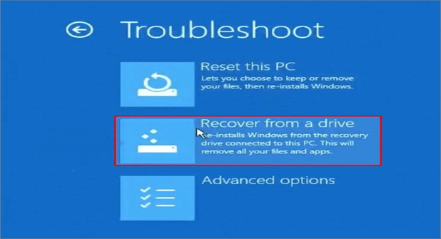
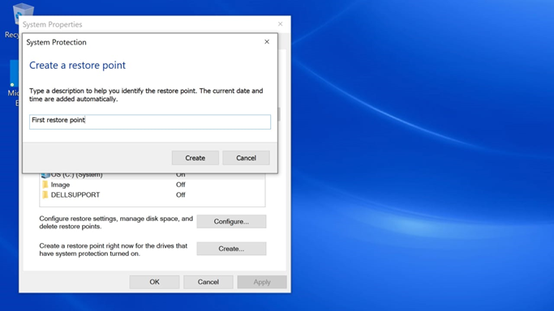
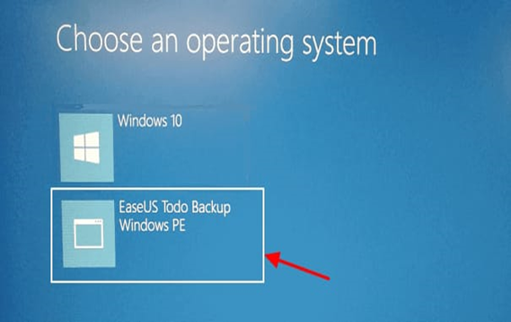
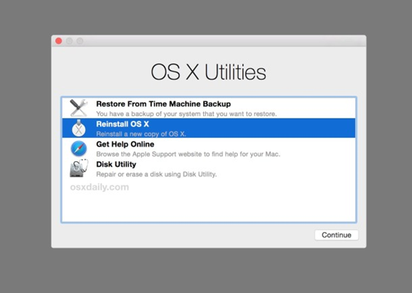

# OS-EX.3-TROUBLESHOOTING-OF-OS---CASE-STUDY

# AIM:
To Troubleshooting of Operating System

# STEPS:

# 6. Run Diagnostic Tools:
Use built-in diagnostic tools provided by the operating system to identify hardware or software problems.

# 7. Review Event Logs:
Check the system logs for error messages or warnings that might provide clues about the issue. In Windows, you can use the Event Viewer; in Linux, check syslog or journalctl.

# 8. Remove Recently Installed Software:
If the problem started after installing new software, consider uninstalling it to see if that resolves the issue.

# 9. Safe Mode:

Boot the system into safe mode to check if the problem persists. Safe mode loads the OS with minimal drivers and can help identify if third-party software is causing the issue.

# 10. Virus and Malware Scan:
Perform a full system scan for viruses and malware using reputable antivirus software.

# 11. Check Disk and File System:
Use built-in utilities like chkdsk (Windows) or fsck (Linux) to scan and repair disk errors and file system issues.

# 12. Update Drivers:
Ensure that your hardware drivers (graphics, sound, network) are up to date. Outdated drivers can cause various problems.

# 13. System Restore:
If applicable, consider using system restore points to revert your system to a previous state when it was working correctly.

# 14. Backup Data:
If all else fails and you suspect a major issue, back up your important data before attempting any major repairs or reinstallations.

# 15. Reinstall OS:
As a last resort, you may need to reinstall the operating system. Make sure to back up your data first.

# 16. Seek Help:
If you can't resolve the issue on your own, consider seeking help from online forums, tech support, or a professional technician.

# RESULT:
The Troubleshooting for the Operating System has been successfully done.
